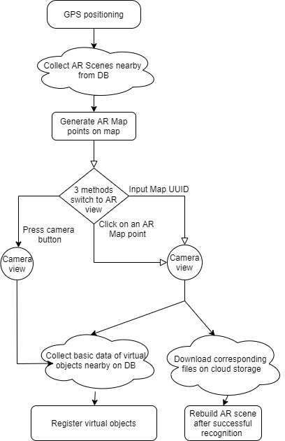
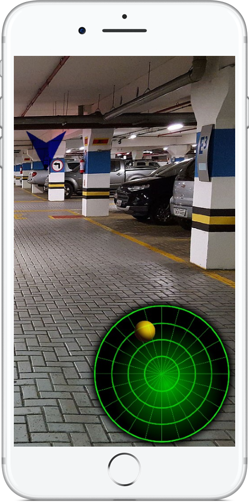
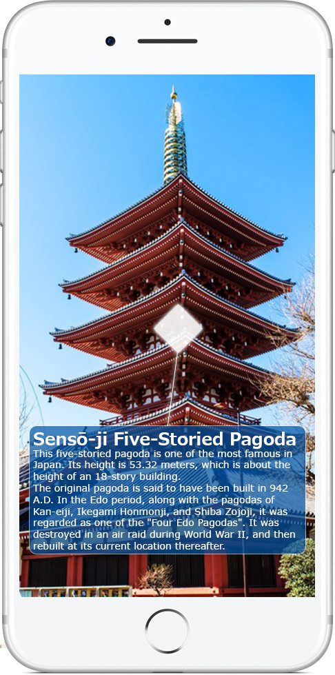

# VisuaLoc : A visual-GPS hybrid AR approach featuring long-range and persistence via cloud

## Abstract 
Location-based or so called GPS-based is now the mainstream choice for outdoor mobile augmented reality (MAR) applications, however because of the lack of accuracy of current GPS technology the performance of location-based AR cannot yet meet the user's needs. 
We propose an approach using vision-based persistence feature of AR combined with traditional GPS tracking method to improve the accuracy of AR registration for long range outdoor applications. 
We designed a prototype application so called VisuaLoc on iOS platform using pre-existing tools and services.
In order to better adapt persistence feature and assist users in understanding the possibility that the current scene can be re-identified and registered, we also proposed an approach which evaluates the current AR scene to guarantee to some extent the reconstructability of the scene, which we called weighted method. 
Experimental results shows our proposed weighted evaluation method has great advantages compared to other two traditional evaluation methods.

## Review of system
The goal is to build a system so called VisuaLoc in which users can set up some virtual objects in a real environment nearby, for example, information panels which contains text and image information that user input, or arrows for navigation, etc. The device collects information from the real environment and generates an ARWORLDMAP, which is a space-mapping state and set of anchors from a world-tracking AR session \cite{arworldmap}. That information then can be uploaded to the cloud and shared with other users.

To read and rebuild an AR scene stored in the cloud, user will first be roughly located within a certain range through GPS, and all AR scenes in this range will appear on the map. By clicking the corresponding scene point, the view will be changed to camera perspective. At the same time, the corresponding files needed to rebuild AR scene will be downloaded. Once the download completes, tracking and registration will be carried out to achieve reconstruction.

A client-server architecture is utilized to manage data of different scenes that clients uploaded, the
client-side application is now only supported for iOS platform. 

## Technical implementation
The current system is only used as a prototype, and the development tools used are all pre-existing tools and services. If the system is put into actual development, specific servers supporting a large number of users and more appropriate AR development tools should be considered.

In this prototype we simply used cloud services provided by Google Firebase. Real-time database is simply used to store each AR object’s (virtual panel with input information, etc.)  basic information, and cloud storage to further store specific files, such as files containing information of each ARWORLDMAP. We also made use authentication services of Firebase to implement an user authentication system. 

Client-side application is developed with interactive 3D graphic authoring tool Unity within AR development library ARKIT2 by Apple. An open source toolset for displaying maps Mapbox SDK for Unity is used for implemeting the localization function with device's GPS unit.  Unity project is then built in XCode into an iOS application. 

## Prerequisites

- Unity3D engine 2019.4 or newer
- ARKit 2
- Xcode 
- ARKit2 supported iOS devices (iPhone 6s and later, all iPad Pro models, iPad 5th generation and iPad 6th generation)

## Construction
We present the construction of VisuaLoc in two main parts: Client side application's User Interaction(UI) design and Server side database management.
The Process of system is given in Figure 1.

|  | 
|:--:| 
| *Figure 1 : Process of system* |
### UI design
Client side application is an iOS application, it consists of three interfaces, the first one is the user login and registration interface, it will then communicate with the server for authentication.

If the login is successful, the application will turn to the second scenario, a two-dimensional map interface. The map is centered on the user's location. From there, through the use of gestures on screen such as pinching, spreading and dragging, the map can be moved and scaled. On this map, a small 3D 'i' form object shows the user's position, and spheres with a photo panel on the top are shown next to user. Each of these objects, so called AR point, presents an AR scene built by users. The visibility of a sphere is determined by the public authorization chosen by the creator of the scene. A slide bar on the top of screen is used to change the range of discoverable scenes nearby. This function helps to reduce the workload of the server to some extent, while meeting the needs of users flexibly.

By clicking on an AR point, the scene turns automatically into the third interface, the camera view in which AR is generated. After entering the selected scenario, the client immediately sends a request to the server and begins to download the corresponding ARWORLDMAP and other Data used to reconstruct the AR scenario. Tracking and registration will be done automatically after downloading. The download time varies depending on the scene size and the quality of network communication, but is generally within 10s. After successful tracking and registration, the virtual objects contained in the scene will reappear in the correct location and the load and rebuilt of AR scene is then finished. 
According to the preset authority of AR scene, users could further change the scene and upload it to the cloud again to cover the previous version.

### Database management
Server offers mainly two services: User authentication and data storage. Both of two services are implemented within pre-existing cloud services of Google Firebase, to be precise, three services are used: Firebase Authentication, Cloud Storage and Real-time Database. 
We use Firebase SDK within Unity to realize the communication between user-side application and server through the corresponding API.

In our prototype a basic user authentication is implemented, it requires only the uniqueness of user's email address and the consistency of password. For security reasons, a further verification of user's email address would be taken into consideration.

Real-time Database of Firebase is a NoSQL cloud database, Data is synced across all clients in real-time, and remains available when application goes offline. In VisuaLoc, basic information about each visual item and each AR map that users created is stored in this database as soon as an item is created and an AR scene is uploaded. The database is a NoSQL key-value type database. 

## Possible use cases
We introduce some  examples of common possible use cases of VisuaLoc. Three main areas are involved: Navigation, Tourism and Information sharing, and finally Entertainment.
|||
|:--:| :--:| 
| *Indoor marking and navigation* | *Tourism and Information sharing* |

### Indoor marking and navigation
VisuaLoc is a good alternative for indoor navigation or in navigation where high accuracy is required. Users can manually set up a route in the AR scene, and upload it at the entrance of a building, where the GPS localization accuracy is relatively good and where it is easy to be recognized by user.

### Tourism and Information sharing
A location-based AR is very suitable to share information relative to locations. For example, comments on places such as restaurants in shape of virtual panels next to the places; Photos and information of suspected lost pets located where they were last seen; Tourism information showing directly next to touristic attractions, etc.

### Entertainment
From the entertainment point of view, the most adapted form of game with Visu-aLoc is a treasure hunt or escape game. Many of this kind of game through theneighbourhood with or without AR exist. 
, VisuaLoc can be used for morefree-form game development, users can set up their own custom AR puzzle gamethrough combination of preset virtual items in any part of the globe and making itavailable to all users. It
